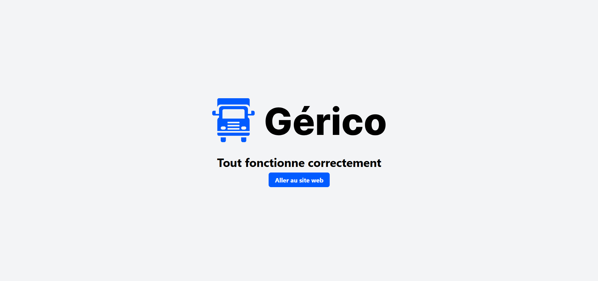

<div align="center">
  
</div>
<h1 align="center">
  Gérico Transport Server
</h1>



#### This is the Server for [Gérico Transport](http://gericotransport.fr)

## 🛠 Installation & Set Up

1. Download the repo :up:

   > [click here](https://github.com/AbassHammed/gerico-server)

2. Install and use the correct version of Node using [NVM](https://github.com/nvm-sh/nvm) (`The .nvmrc file precise the exact node version used`)

   ```sh
   nvm install
   ```

3. Install dependencies from the directory path

   ```sh
   npm install
   ```

4. Create your `.env` file, copy the `.env.example` with your config

5. Start the development server

   ```sh
   npm run dev
   ```

## 🚀 Building and Running for Production

1. Generate a full static production build

   ```sh
   npm run build
   ```

1. Preview the site as it will appear once deployed

   ```sh
   npm start
   ```

## 🚀 Building and Running for Production (Docker)

1. Generate a full static production build

   ```sh
   docker compose up
   ```
